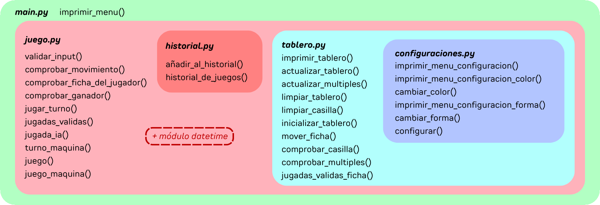

# Chinese checkers

Chinese Checkers is a board game that is originally played on a star-shaped board with 121 slots. In this game, the objective is to move all your pieces to the opposite side of the board. Opponent's pieces cannot be captured, and they can only move diagonally.

For this project, the rules of Chinese Checkers are adapted to be played on a regular 8x8 chessboard. Pieces start from the same initial position as in a regular checkers game. Finally, the pieces continue to move exclusively diagonally and cannot capture opponent pieces. The objective of this project is to recreate a game similar to Chinese Checkers on an 8x8 board in a digital environment using Python.

This program was developed as my final project for the Programming 1 course at UTEC. Please note that the program is entirely in Spanish.

## Program Functionality

### File `configuraciones.py` (Handles game settings)

In the global section of the function, the default colors for pieces are set to red and blue, and their shapes to "O" and "X". A dictionary `colores` is also created containing the names and ANSI codes of all available colors.

**Relevant Functions:**

- `imprimir_menu_configuracion()`: Displays the configuration menu with options to change the color and shape of the pieces.

- `imprimir_menu_configuracion_color()`: Displays the menu for changing the colors of each player's pieces.

- `cambiar_color()`: Allows the user to modify the color of each player's pieces, ensuring the colors are different.

- `imprimir_menu_configuracion_forma()`: Displays the menu for changing the shapes of the pieces.

- `cambiar_forma()`: Allows the user to change the shape (symbol) of each player's pieces, ensuring they are different and a single character.

- `configurar()`: Controls the flow of the configuration menu.

### File `tablero.py` (Handles the representation and manipulation of the game board)

In the global section, the `colores` dictionary from `configuraciones.py` is imported, and an 8x8 board is created where blank spaces are represented by "-".

**Relevant Functions:**

- `imprimir_tablero()`: Prints the board in the console with labels for columns (A to H) and rows (1 to 8).

- `actualizar_tablero(...)`: Updates a specific position on the board with a piece of a certain color.

- `actualizar_multiples(...)`: Updates multiple positions on the board.

- `limpiar_tablero()`: Resets the board to its initial state.

- `limpiar_casilla(...)`: Clears a specific cell on the board.

- `inicializar_tablero(...)`: Sets up the board for the start of a game.

- `mover_ficha(...)`: Moves a piece from one position to another.

- `comprobar_casilla(...)`: Checks if a specific cell contains a given piece and color.

- `comprobar_multiples(...)`: Checks if a list of cells contains a given piece and color.

- `jugadas_validas_ficha(...)`: Determines valid diagonal moves for a piece at the specified position.

### File `historial.py` (Manages the game history)

Manages game history by importing previously saved history from `historial.txt` and maintaining a list to store the details of each game.

**Relevant Functions:**

- `añadir_al_historial(...)`: Adds the details of a completed game to the game history.

- `historial_de_juegos()`: Prints the game history.

### File `juego.py` (Controls the main game logic)

Imports `datetime` to handle dates and times in the game, along with functions from `historial.py` and `tablero.py`.

**Relevant Functions:**

- `validar_input(...)`: Validates the player's move.

- `comprobar_movimiento(...)`: Validates that the move is allowed.

- `comprobar_ficha_del_jugador(...)`: Checks if the original position of the piece belongs to the player.

- `comprobar_ganador(...)`: Checks which player has won.

- `jugar_turno(...)`: Combines previous functions to validate and process the player's move.

- `jugadas_validas(...)`: Determines all valid moves for all pieces of a given type and color.

- `jugada_ia(...)`: Selects the best possible move for the AI based on a list of valid moves.

- `turno_maquina(...)`: Executes the AI's turn, including printing the board and updating piece positions.

- `juego()`: Initializes the board and controls the game flow until a player wins or the game is canceled, and records the game history.

- `juego_maquina()`: Manages the game flow when playing against the AI, alternating turns until a player wins or the game is canceled.

### File `main.py` (Main entry point of the program)

Imports `juego.py`, `historial.py`, and `configuraciones.py`. Sets the boolean variable `jugando` to true to indicate an ongoing game.

**Relevant Functions:**

- `imprimir_menu()`: Displays the main menu with options to play, view history, configure settings, or exit.

A main loop called "while jugando" is defined to call the corresponding functions based on user input.